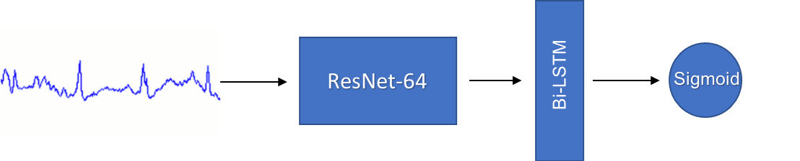

# Classification of True or False Arryhthmia ECG Alarms in the ICU

This repository contains supplementary materials from a research project for determining whether an ECG arrhythmia alarm in the ICM is a true alarm or a false alarm. This is done by classifying the ECG segment immediately following an alarm into either that of a true alarm or a false alarm, as accurately as possible and as early as possible. This research resulted in an advancement of the state of the art, mostly resulting from 2015 PhysioNet/CinC Challenge (https://www.physionet.org/content/challenge-2015/1.0.0/).

**Contents in this repository:**

## Paper:
1. CinC 2021 abstract [pdf](abstract.pdf)
2. CinC 2021 full paper [pdf] -- will be posted soon

## Source codes:
1. ResNet + BiLSTM Model Architecture and supporting code [python (link)](resnet_attention.py)
       
2. WFDB ECG Segment splitting and data preparation [python (link)](split.py)

## Data sets:

